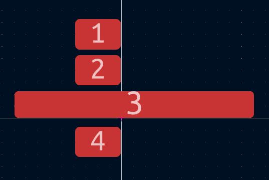

----
# 16 June 2025

Okay, so i have thought of making an SDR, and yeah, i would love to make one using the Great RP2040. The idea is very rough yet, i have to work on it too much

What I(and a little bit of gpt) came up with:
#### this is [excalidraw](https://excalidraw.com) btw

### Time Spent Today: 30 mins
----
# 18 June 2025

Okay, so today i found a few components for the mini SDR. Here they are:  
LNA: PSA4-5043+  
Mixer: ADE-11X+  
ADC: ADCS7676 (old: ADS7042)  
Processor/Controller: RP2040: Arguable the best MCU ever Made  

### Time Spent on June 18: About 1 hour
----
# 22 June 2025

I chose an LO. Here is the list of the updated parts:  
LNA: [PSA4-5043+](https://www.lcsc.com/product-detail/RF-Amplifiers_Mini-Circuits-PSA4-5043_C5240848.html)  
Mixer: [ADE-11X+](https://lcsc.com/product-detail/RF-Mixers_Mini-Circuits-ADE-11X_C3176636.html)  
LO: [Si5351](https://www.lcsc.com/product-detail/Clock-Generators-PLLs-Frequency-Synthesizers_SKYWORKS-SILICON-LABS-SI5351A-B-GTR_C504891.html)  
LO AMP: [GALI-84+](https://lcsc.com/product-detail/RF-Amplifiers_Mini-Circuits-GALI-84_C3193261.html)  
ADC: [ADCS7476](https://lcsc.com/product-detail/Analog-to-Digital-Converters-ADC_Texas-Instruments-ADCS7476AIMFX-NOPB_C91530.html) (old: [ADS7042](https://lcsc.com/product-detail/Analog-to-Digital-Converters-ADC_Texas-Instruments-ADS7042IDCUR_C701641.html))  
Processor: [RP2040](https://www.lcsc.com/product-detail/Microcontrollers-MCU-MPU-SOC_Raspberry-Pi-RP2040_C2040.html)  
Crystal for RP2040: [ABM8-272-T3](https://lcsc.com/product-detail/Crystals_Abracon-LLC-ABM8-272-T3_C20625731.html)   
LPF: Simple LC Circuit  
XTAL: [XXGBBCNANF-25.000000MHZ
](https://lcsc.com/product-detail/Crystals_TAITIEN-Elec-XXGBBCNANF-25-000000MHZ_C521601.html)  

### Updated Block DIag:

Umm okay, i did i BIT of schematic(or most of it cuz idk how much is left). Gonna take a break now, i think i might do some more later, so, will update the schematic later.

### Big Change: I am changing my ADC to the [ADCS7476](https://lcsc.com/product-detail/Analog-to-Digital-Converters-ADC_Texas-Instruments-ADCS7476AIMFX-NOPB_C91530.html)

Most of the schematic is now done. only connections to the rp2040 remaining prolly. Image:

  
HELL YEAH! So much work done in a single day!!  

### Time Spent Today: 4 hours
----

# 23 June 2025

Yup, todya i am working on completing scheamtic, assigning and gathering footprints, and starting with the PCB. 

I want to make the footprint like Cyao has made in his [ESP-USB](https://github.com/cheyao/esp-usb). So i started out to make my own footprint, but after having less luck with myself, i just took it from [Cyao](https://github.com/cheyao/esp-usb/tree/main/hardware/esp-usb-lib.pretty). Hehehe thanks Cyao. This is the shit i thought i was cooking lol

I was thinking of using LEDs on SPI and I2C lines, but then GPT told me it was not ideal, so i did not simply put it!

oh yeah, btw i forgot to explain some stuff. This project uses a few RF ICs to convert the incoming frequencies into IF(Intermediate Frequency). This IF is then read by an ADC at 1 MSPS(Mega Samples Per second). ADC converts Analog values to digital values and RP2040 reads via SPI. this is then sent to PC where it is read by some other software.

did a bit of PCB, will upload the images later
Here are the images: 

### Total Time Spent Today: 2 hours 30 mins
----
# June 24 2025

Hell yeah, i worked on my PCB in the school today, i got permission to bring my laptop hahaha. here is the progress:

oh hell nah, i forgot the ss and continued further, so nvm, here is the current progress:

worked a lot on the PCB, will update soon!!  

### Time Spent Today: 1 hour 30 mins

# June 25 2025

Changed something on the schematic today that i dont remember. and also worked on the PCB. 

I always order from [PCB Power](pcbpower.com) and i found out they have their own page for controlled impedance trace widths, so i dont need to calculate anything for the RF Layout!!

I have plans to work today later but i have to study too so let's see, if i get time i will finish the routing part and then move on to BOM and README and submitting.  
Current Progress:  

I realised my mistake, for onboard USB connector, i will need to have the board 2.00 mm thick instead of 1.6mm thick, which is gonna increase the cost significantly, like the normal 4 layer board was about $45, but now if i order the same, it WILL be minimum $75, which i dont wanna give just for a single PCB, so instead i am gonna save costs and add the normal USB A Connector

Yay, i think i am doe with my PCB. all nets routed, all DRC errors un-errored(is that even a real word??) and wow, i can start working on the BOM from tomorrow. :))  
Da LOOK Of MA' QUEEN:  

Time Spent Today: 45 mins

# June 26 2025

One of my friends suggested me that i should not have direct 90 deg VBUS connections, even though they are via a via. so i am gonna thange that rn

I believe this should be the final look of the PCB:  

Final schematic:  
  
The 3D model of the PCB looks like this:  
  

# June 27 2025

I forgot to add the silkscreen today, so now i added it, here it is:

