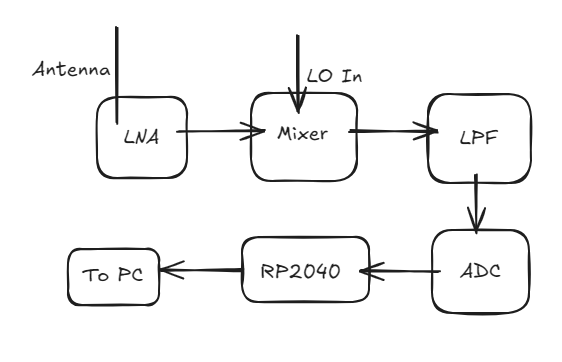

# 16 June 2025

Okay, so i have thought of making an SDR, and yeah, i would love to make one using the Great RP2040. The idea is very rough yet, i have to work on it too much

What I(and a little bit of gpt) came up with:
#### this is [excalidraw](https://excalidraw.com) btw

### Time Spent Today: 30 mins

# 18 June 2025

Okay, so today i found a few components for the mini SDR. Here they are:
LNA: PSA4-5043+
Mixer: ADE-11X+
ADC: ADS7042
Processor/Controller: RP2040: Arguable the best MCU ever Made